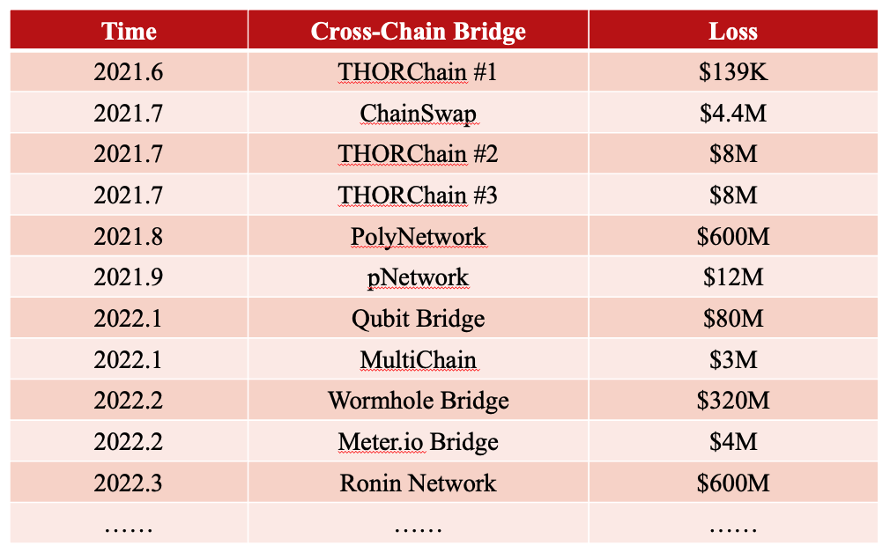

# Cross-Chain Bridge Attacks

| Attacks        | Reports                                                      |
| -------------- | ------------------------------------------------------------ |
| THORChain # 1  | https://medium.com/thorchain/eth-parsing-error-and-exploit-3b343aa6466f |
| THORChain # 2  | https://thearchitect.notion.site/THORChain-Incident-07-15-7d205f91924e44a5b6499b6df5f6c210 |
| THORChain # 3  | https://thearchitect.notion.site/THORChain-Incident-07-22-874a06db7bf8466caf240e1823697e35 |
| pNetwork       | https://medium.com/pnetwork/pnetwork-post-mortem-pbtc-on-bsc-exploit-170890c58d5f |
| Anyswap        | https://medium.com/multichainorg/anyswap-multichain-router-v3-exploit-statement-6833f1b7e6fb |
| Qubit Bridge   | https://medium.com/@QubitFin/protocol-exploit-report-305c34540fa3 |
| MultiChain     | https://medium.com/zengo/without-permit-multichains-exploit-explained-8417e8c1639b |
| Polynetwork    | https://blocksecteam.medium.com/the-further-analysis-of-the-poly-network-attack-6c459199c057 |
| Synapse Bridge | https://synapseprotocol.medium.com/11-06-2021-post-mortem-of-synapse-metapool-exploit-3003b4df4ef4 |
| Ronin          | https://roninblockchain.substack.com/p/community-alert-ronin-validators?s=w |
| meter.io       | https://halborn.com/explained-the-meter-io-hack-february-2022/ |
| Wormhole       | https://extropy-io.medium.com/solanas-wormhole-hack-post-mortem-analysis-3b68b9e88e13 |

